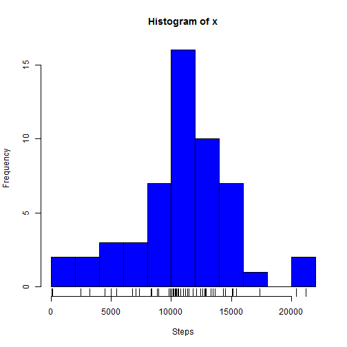
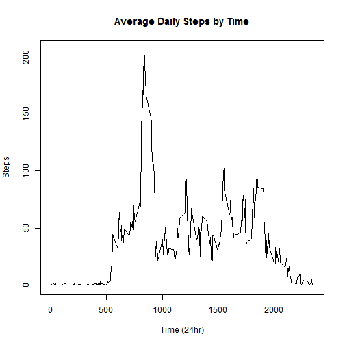
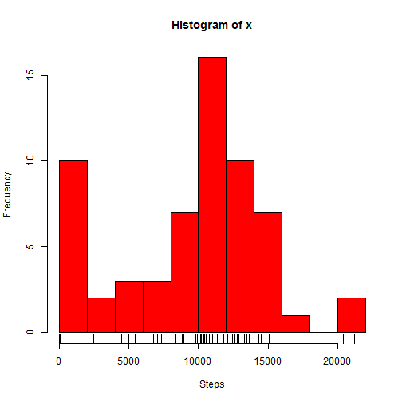
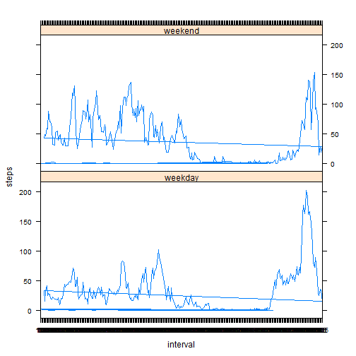

# Reproducible Research: Peer Assessment 1


## Loading and preprocessing the data
Activity data is read into a data table with columns 'steps', 'date', and 'interval'.  Steps is the number of steps taken in a 5 minute interval, date is the date of the measurement, interval is the 5 minute period of the date.


```r
data <- read.csv("repdata_data_activity/activity.csv", header = TRUE, colClasses = c("integer", 
    "factor", "integer"))
data$date <- as.Date(data$date, format = "%Y-%m-%d")
```


## What is mean total number of steps taken per day?
The following calculates the total steps per day, and plots that as a histogram.  Additionally the daily step mean and median are calculated.

```r
x <- tapply(data$steps, data$date, sum)
hist(x, xlab = "Steps", breaks = 15, col = "blue")
rug(x)
```

 

```r
mean(x, na.rm = TRUE)
```

```
## [1] 10766
```

```r
median(x, na.rm = TRUE)
```

```
## [1] 10765
```


## What is the average daily activity pattern?

```r
daily = tapply(data$steps, data$interval, mean, na.rm = TRUE)
data$interval <- as.factor(data$interval)
plot(x = levels(data$interval), y = daily, type = "l", xlab = "Time (24hr)", 
    ylab = "Steps", main = "Average Daily Steps by Time")
```

 


The highest daily average activity occurs at:

```r
time <- levels(data$interval)
df <- data.frame(time, daily)
df[min(which((df$daily == max(df$daily)) == TRUE)), ]
```

```
##     time daily
## 835  835 206.2
```


## Imputing missing values
Total number of missing values for steps:

```r
sum(is.na(data$steps))
```

```
## [1] 2304
```


There are quite a few missing values in this data set, and the most logical method would be to replace the missing values with the average number of steps for the given interval in a given portion of the week (weekday vs weekend).  However most of these values come at a time when activity is typically nominal, so for simplicity's sake NA values will be replaced with 0s.


```r
data2 <- data
data2[is.na(data2)] <- 0

x <- tapply(data2$steps, data2$date, sum)
hist(x, xlab = "Steps", breaks = 15, col = "red")
rug(x)
```

 

```r
mean(x, na.rm = TRUE)
```

```
## [1] 9354
```

```r
median(x, na.rm = TRUE)
```

```
## [1] 10395
```


These values are now lower than the original estimates.  The impact of adding in values to the total steps for a given day is obvious, the total steps would go up for non-zero additions.  In this case the average steps per day did not increase (0 values were added), which would imply that entire day's worth of data is was missing for the data set.

## Are there differences in activity patterns between weekdays and weekends?

```r
weekday <- weekdays(data2$date)
for (i in 1:length(weekday)) {
    if (weekday[i] == "Saturday" | weekday[i] == "Sunday") {
        weekday[i] <- "weekend"
    } else {
        weekday[i] <- "weekday"
    }
}
data2$weekday <- weekday
data2$weekday <- as.factor(data2$weekday)

library(lattice)
dailyweek <- tapply(data2$steps[data2$weekday == "weekday"], data2$interval[data2$weekday == 
    "weekday"], mean)
dailyend <- tapply(data2$steps[data2$weekday == "weekend"], data2$interval[data2$weekday == 
    "weekend"], mean)
df1 <- data.frame(dailyweek, levels(data2$interval), "weekday")
df2 <- data.frame(dailyend, levels(data2$interval), "weekend")
colnames(df1) <- c("steps", "interval", "weekdays")
colnames(df2) <- c("steps", "interval", "weekdays")
df3 <- rbind(df1, df2)
df3$weekday <- as.factor(df3$weekday)
xyplot(steps ~ interval | weekdays, data = df3, type = "l", layout = c(1, 2))
```

 

